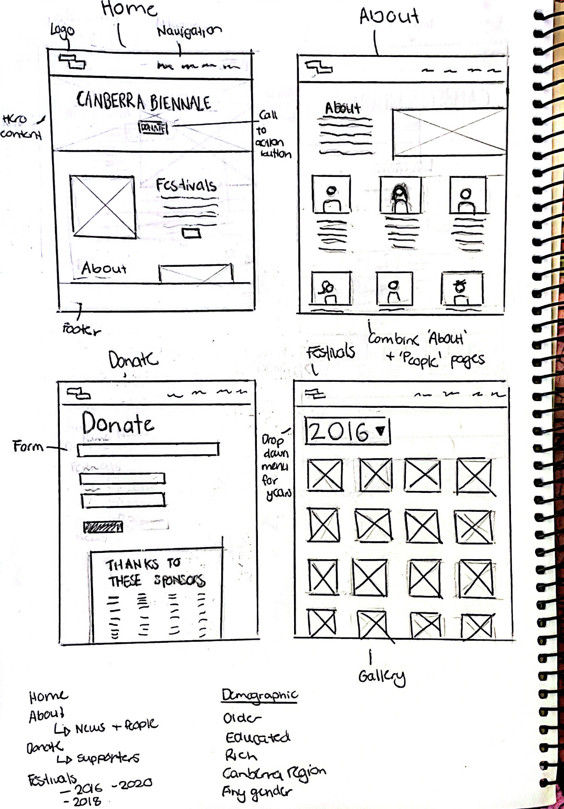

# Project 1: Responsive Website

This assignment involved building a functional website using HTML5 and CSS for the Contour 556 website. To begin this project, I first had to consider the function and target demographic of the site. As discussed during tutorials, the function of the Contour 556 website, is to promote the Canberra Art Biennale festival to Canberrans. Their primary demographic consists of upper to upper-middle class citizens with a higher education. This audience is skewed older, as they require both free time and a sincere appreciation for arts and culture. The new design therefore, must accommodate this audience, with a clear and effective interface that is easy to operate. 

Having established the function and demographic, I proceeded to study the current design of Contour 556. This allowed me to recognise what had to be changed for a more effective website. This process evolved into creating sketches, as I decided to remove or streamline certain information. For instance, I chose to combine the ‘Supporters’ and ‘Donation’ pages, as well as the ‘About’ and ‘People’ pages, due to the similar content. Similarly, I entirely removed the ‘News’, ‘City Commissions’ and ‘Covid’ pages, as I felt they were either dated or irrelevant to the primary function of the website. The designs themselves are quite generic, with the layout of each page derived from current web trends. The sketches also featured elements such as hero content, call-to-action buttons, a map, photo galleries and a navigation bar. I considered a photo gallery and location information particularly important, as the entire purpose of the festival, and subsequently the website, is to promote the art placed around Canberra. Contour 556 additionally incorporates a vibrant pink within their marketing, however, I opted to use yellow and blue for the new design, as I consider these colours calmer and more appropriate for the demographic. 

During the coding segment of the project, my process involved writing the HTML, before proceeding with the CSS and the Javascript where necessary. The most difficult aspect of this assignment was the layout of the text, particularly ensuring that it was responsive. I therefore worked in sections, regularly checking the code was operating as it should, before trying to make a new element. Occasionally, if a particular new segment was ruining the website, I would ‘comment’ out the code and test to see what was wrong. 

I had previously made a Navigation bar, however I had never incorporated a dropdown menu. This took some practice and persistence, as the prior ‘ul’ and ‘li’ styling often interfered with the new CSS I was trying to add to the drop down menu. I realised however, the usefulness of classes, as they allowed me to merge and isolate certain features across multiple divs. Similarly making the navigation bar responsive was difficult, however I opted to make a hamburger menu. This meant making the list items vertical, incorporating icons as well as a sliding rectangle which would act as the navigation for mobile devices. I also struggled with the about page, as I wanted to format the information and images regarding ‘The Team’ in two columns. There were issues however, due to the text being differing lengths and the images not aligning as they were intended. This was resolved however, as I again operated through research, as well as trial and error.

Creating a donation form was initially daunting, however there were multiple sources that provided inspiration and guidance on the best approaches to incorporating the ‘input’ tag, and formatting each div in an effective way. 

Throughout this coding process, I had to compromise some of my initial ideas, as I was either unsure how to properly implement them, or I preferred a different design in the moment. For instance, I had originally planned to include a horizontal media scroller that would feature the News. However I was unsure about the best approach for coding this, and realised that the News segment was not entirely necessary given Contour 556 has a newsletter and social media platforms. My initial sketches were additionally altered, as I decided to change aesthetic choices such as the placement and size of images and text. If I were to complete this assignment again, I would predominantly focus on fixing the mistakes and perfecting the details. I would fix the spacing on certain pages, as some segments are too separated from one another. I would either make a new logo, or use the redesigned Contour 556 one, as I feel the one used on the site is too small and could be improved. My main discrepancies however are with the image gallery. Given more time and effort, I would adjust the images to all be equal in size, or otherwise fix the overlay to be the same size as the image. The current gallery I have made is functional, however I think having this consistency would have elevated the design. Similarly I noticed another student had considered the mobile users more thoroughly, and had altered the gallery to show information without a hover effect. I would also incorporate a slideshow on each individual artists’ page, thereby properly showcasing their artworks on the site. I used the W3schools Validator in order to correct my coding errors. This process was very necessary as I had a number of issues I was not aware of. For instance, I had forgotten to incorporate ‘alt’ text for my logo image. I had also named many of my image assets with spaces, which is illegal and had to be changed for the final site. One problem that I did not immediately understand how to resolve, was an error declaring there was a stray footer start tag. I eventually realised that the tag was outside the end </body> tag and therefore was in a context where no elements can be started. The code also had many unnecessary end tags that had to be removed, as they had no correlating open tag. 

Overall, I think the website I have provided is clean, with a cohesive colour palette and simple page layouts that consider the target demographic. I appreciate the reduction of pages, as the site now appears to prioritise the festival, the artwork and the donations as the primary intentions of Contour 556. I learnt many new techniques, primarily regarding image galleries, web layout and responsive coding. Whilst I may not have included all my initial ideas, I think the final product is a successful website that achieves its intended goals. 

# References

CodingNepal, (2020), *'Responsive Dropdown Menu Bar with HTML & CSS'*, [YouTube] https://www.youtube.com/watch?v=Iyx_809qwoc - This source was extremely useful, as I had previously made a Navigation Bar, but had never attempted a drop down menu. The YouTube video provided insight into incorporating an unordered list within another list, thereby creating an opportunity to manipulate the two items using CSS. 

Daily Tuition (2019), *'Complete Responvie Blooger Website Using HTML/CSS'*, [YouTube], https://www.youtube.com/watch?v=CrSC1ZA9j0M - This YouTube video was useful in that it communicated how @media could be manipulated in order to create a responsive site. I tried to adopt similar techniques in my own website, forcing page elements to adjust in size and placement, in order to accomodate different screens. 

Dev Ed (2019), *'Learn HTML5 and CSS3 For Beginners - Crash Course'* [YouTube] https://www.youtube.com/watch?v=vQWlgd7hV4A&t=13416s - I watched parts of this video at the beginning of this project, in order to remember the basics of HTML and CSS. I found this source highly informative and clear, with the instructor providing context and explanations for how each element functioned. 

Easy Tutorials (2020). *'How To Make Responsive Web Design Using HTML and CSS Step By Step'* [YouTube], https://www.youtube.com/watch?v=lAOkx2yZESY&t=1035s - This website was highly useful, as it provided informtion about creating a homepage, as well as making the design responsive. This included changing the navigation bar into a hamburger menu, as this is a more appropriate navigation tool on a handheld device.

Flux (2020), *'CREATING A GOOD HERO FOR YOUR WEBSITE: Free Web Design Course 2020 | Episode 10'*, https://www.youtube.com/watch?v=flAcHu-squc - This YouTube video provided information on how to design effective and appealing Hero Content. This video inspired me to incorporate a hero banner into the design.

Fitzgerald, A. (2020), *' What Are CSS Hover Animations & How Can You Use Them?'* https://blog.hubspot.com/website/css-hover-animation - This source reminded me how to apply Hover animations using HTML and CSS. As I incorporated a number of animations within the website, this information was extremely helpful and provided sufficient content.

Fitzgerald, A. (2020), *'How to Bold, Italicize & Format Text in HTML'* https://blog.hubspot.com/website/how-to-bold-in-html#:~:text=To%20bold%20the%20text%20in,property%20set%20to%20%E2%80%9Cbold.%E2%80%9D - This source helped me remember how to apply <strong> and <em> tags in order to bold and italicize text within HTML. 

MDN Web Docs, (n.d.), *'display'*, https://developer.mozilla.org/en-US/docs/Web/CSS/display 

Mr Web Designer (2021), *'Create A Responsive Payment Gateway Form Design Using HTML & CSS Only'* [YouTube] https://www.youtube.com/watch?v=cce_70pxbqw - This video was extremely helpful in clarifying how to create a donation form using HTML and CSS. I watched the video and recognised how I could incorporate 'input' boxes within my own form, as well as icons and animation. 

Simplilearn (2021), *'Dropdown In HTML | How To Create Dropdown In HTML | HTML Dropdown Menu Tutorial | Simplilearn'* https://www.youtube.com/watch?v=gEbG3xyQoxA - This source was very useful, providing instruction on how to create a dropdown menu using HTML and CSS. The YouTube video provided insight into incorporating an unordered list within another list, thereby creating an opportunity to manipulate the two items using CSS. 

The University of Maine (2022), *'How to embed a Google Map into a web page'*, https://extension.umaine.edu/plugged-in/technology-marketing-communications/web/tips-for-web-managers/embed-map/ - Useful site which provided instructions on how to quickly and easily embed a map into a website.

tipswithpunch (2018), *'Embed a YouTube Video in HTML and Make it Responsive (CSS included)'*, https://www.youtube.com/watch?v=9YffrCViTVk - This site helped me figure out how to embed YouTube videos into a website. 

W3Schools, (2022), *'Learn to Code'*, https://www.w3schools.com/html/default.asp - W3Schools is an extremely useful site which offers explanation and examples of HTML and CSS code for beginners. I used this site whenever I was unsure about how to perform basic functions. 

Icons: https://fontawesome.com/v4/ 
https://fontawesome.com/start 